NAT Slipstreaming
======================

<a href="https://samy.pl/slipstream/">NAT Slipstreaming</a> allows an attacker to remotely access any TCP/UDP service bound to <b>any system</b> behind a victim's NAT, bypassing the victim's NAT/firewall (remote arbitrary firewall pinhole control), just by the victim visiting a website.

<p><strong>v1 developed by</strong>: <a target=_blank href="https://twitter.com/samykamkar">@SamyKamkar</a> // <a target=_blank href="https://samy.pl">https://samy.pl</a><br>
<strong>v2 developed by</strong>: Samy Kamkar && (Ben Seri && Gregory Vishnipolsky of <a target=_blank href="https://armis.com">Armis</a>).

<strong>Read <a href="https://www.armis.com/research/nat-slipstreaming-v20/">Ben & Gregory's excellent technical writeup on v2 here</a></strong> which goes deep into their updates of v2 with plenty of additional details.

<strong>v1 released</strong>: October 31 👻, 2020<br>
<strong>v2 released</strong>: January 26, 2021

**Source code**: <https://github.com/samyk/slipstream>


<!--  -->
[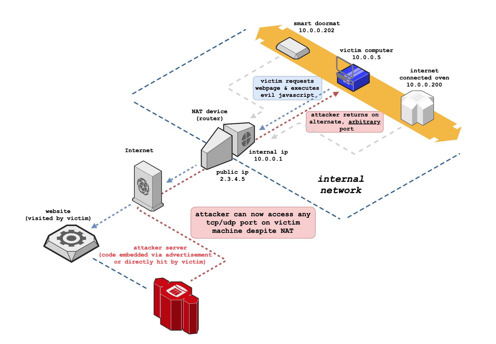](https://samy.pl/slipstream/)
*[animated version here](https://samy.pl/slipstream/) generated with [my fork](https://github.com/samyk/drawio) of [draw.io](draw.io), allowing exportable edge context flow & control in animations*


Table of Contents
=================


   * [Summary](#summary)
   * [The deets](#the-deets)
      * [Network Address Translation (NAT)](#network-address-translation-nat)
         * [Connection Tracking](#connection-tracking)
         * [Application Level Gateway](#application-level-gateway)
      * [Router Investigation / Firmware Dumping](#router-investigation--firmware-dumping)
      * [Reverse Engineering Firmware](#reverse-engineering-firmware)
         * [Finding Interesting Files](#finding-interesting-files)
         * [Exploring interesting functions](#exploring-interesting-functions)
         * [Ports / Services to investigate](#ports--services-to-investigate)
         * [Reversing the Kernel Object](#reversing-the-kernel-object)
      * [Connection Tracking / Application Level Gateway Investigation](#connection-tracking--application-level-gateway-investigation)
         * [Linux Netfilter](#linux-netfilter)
      * [Packet Boundary / Fragmentation Control](#packet-boundary--fragmentation-control)
      * [TCP Timing Attack / Internal Subnet &amp; IP Discovery](#tcp-timing-attack--internal-subnet--ip-discovery)
         * [Timing Attack](#timing-attack)
      * [Browser Protocol Confusion](#browser-protocol-confusion)
         * [Live Browser Packet Alteration](#live-browser-packet-alteration)
   * [Other Findings](#other-findings)
   * [Download](#download)
   * [Contact](#contact)

# Summary

NAT Slipstreaming exploits the user's browser in conjunction with the Application Level Gateway (ALG) connection tracking mechanism built into NATs, routers, and firewalls by chaining internal IP extraction via timing attack or WebRTC, automated remote MTU and IP fragmentation discovery, TCP packet size massaging, TURN authentication misuse, precise packet boundary control, and protocol confusion through browser abuse. As it's the NAT or firewall that opens the destination port, this bypasses any browser-based port restrictions.

This attack takes advantage of arbitrary control of the data portion of some TCP and UDP packets <i>without</i> including HTTP or other headers; the attack performs this new packet injection technique across all major modern (and older) browsers, and is a modernized version to my original <a target=_blank href="https://samy.pl/natpin/">NAT Pinning technique from 2010</a> (presented at DEFCON 18 + Black Hat 2010). Additionally, new techniques for local IP address discovery are included.

This attack requires the NAT/firewall to support ALG (Application Level Gateways), which are mandatory for protocols that can use multiple ports (control channel + data channel) such as SIP and H323 (VoIP protocols), FTP, IRC DCC, etc.

**At a high level, NAT Slipstreaming works like so:**

- victim visits malicious site (or site with malicious advertisement)
- internal IP of victim first must be extracted by browser and sent to server
  - internal IP attempted to be extracted via [WebRTC](https://www.w3.org/TR/webrtc/) data channel over https
      - some browsers (Chrome) only divulge the local IP via WebRTC over HTTPS but some of our attacks require HTTP so we first redirect to the HTTPS version of the attack software to extract the local IP
      - we then redirect to the HTTP version with the local IP included in the URL if we were able to obtain it to bypass other cross-origin protection mechanisms (the `.local` mDNS/Bonjour address presented will not be useful for the attack)
  - if internal IP not divulged by WebRTC (Safari) or no WebRTC (<= IE11), **web-based TCP timing attack performed**
     - hidden `img` tags to all common gateways (eg `192.168.0.1`) are loaded in background
     - `onerror/onsuccess` events attached to `img` tags
     - if any TCP RST returned by gateway (or SYN + HTTP response), we've detected valid subnet
     - re-perform timing attack across all IPs on detected subnets (/24), measuring time to onerror/onsuccess firing
     - fastest response is likely internal IP, though all responses are considered victim internal IP candidates and attacked
- large TCP beacon sent via hidden form and automatic HTTP POST to attacker "HTTP server" bound to a non-standard port to force TCP segmentation and maximum MTU size discovery of the victim's IP stack
  - attacker TCP server sends [Maximum Segment Size](https://tools.ietf.org/html/rfc793#section-3.1) TCP Option to massage victim outbound packet sizes ([RFC 793 x3.1](https://tools.ietf.org/html/rfc793#section-3.1)), allowing control of how large browser TCP packets will be
- large UDP beacon sent from browser via WebRTC TURN authentication mechanism to non-standard port to attacker's server to force IP fragmentation with TURN `username` field stuffed
  - we perform a similar attack as our TCP segmentation, but over UDP as IP fragmentation will occur and provide different values than TCP segmentation
  - victim MTU size, IP header size, IP packet size, TCP header size, TCP segment sizes detected by server and sent back to victim's browser, used later for packet stuffing
- (v1) "SIP packet" in new hidden form generated, containing internal IP to trigger Application Level Gateway connection tracking
  - "HTTP POST" to server on TCP port 5060 (SIP port) initiated, avoiding [restricted browser ports](https://github.com/samyk/chromium/blob/2d57e5b8afc6d01b344a8d95d3470d46b35845c5/net/base/port_util.cc#L20-L90)
  - POST data is "stuffed" to exact TCP segment size / packet boundary, then "SIP packet" appended and posted via web form
  - <b>victim IP stack breaks the POST into multiple TCP packets, leaving the "SIP packet" (as part of POST data) in its own TCP packet without any accompanying HTTP headers</b>
  - if browser alters size of multipart/form boundary (Firefox) or packet size changes for any other reason, size change is communicated back to client and client auto-resends with new size
  - when opening UDP port, SIP packet is sent over TURN protocol inside specially crafted `username` field forcing IP fragmentation and precise boundary control
- (v2) "H.323 packet" using TCP-based STUN (bypassing patches for v1 and browser port restrictions) connection generated, containing internal IP to trigger Application Level Gateway connection tracking, but forcing a redirect to <strong>any other host on the network</strong> in a "call forwarding" packet
  - "H.323 call forward" to server on TCP port 1720 (H.323 port) initiated, avoiding <a target=_blank href="https://github.com/samyk/chromium/blob/2d57e5b8afc6d01b344a8d95d3470d46b35845c5/net/base/port_util.cc#L20-L90">restricted browser ports</a>, despite the port being blocked -- port evasion performed by using WebRTC STUN feature which does not respect the restricted port list</li>
  - <code>username</code> field is "stuffed" to exact TCP segment size / packet boundary, then &ldquo;H.323 packet&rdquo; appended and posted via web form</li>
  - <b>victim IP stack breaks the POST into multiple TCP packets, leaving the "H.323 packet" (as part of STUN data) in its own TCP packet without any accompanying HTTP headers</b></li>
  - if browser alters size of multipart/form boundary (Firefox) or packet size changes for any other reason, size change is communicated back to client and client auto-resends with new size</li>
- victim NAT sees proper SIP REGISTER packet on SIP port or proper H.323 call forward packet (with no HTTP data), triggering ALG to open any TCP/UDP port defined in packet back to any victim host on the network
   - victim NAT rewrites SIP or H.323 packet, replacing internal IP with public IP, hinting to attacker exploit was successful
   - (v2) as H.323 call forwarding can direct to any other IP, packet can contain any internal IP of any other host on the victim's network, triggering the NAT to port forward to any system on the network
   - even if victim NAT normally rewrites source ports, the ALG will still be forced to port forward to the attacker's port of choice as it believes victim machine (or other machine on the network, entirely determined by attacker) opened that port and attacker sees new source port in arriving SIP/H.323 packet 
   - <b>attacker can now bypass victim NAT and connect directly back to any port on any machine on the network, exposing previously protected/hidden services and systems</b>
- <i>to investigate...perhaps by you?</i>
  - non-malicious usage: this technique essentially gives browsers full TCP and UDP socket capability to communicate to any protocol locally on the system; the connection can be abstracted through a cloud server that connects back but the browser just talks to the cloud server as if it's the socket and makes browsers much more powerful to communicate on non-web-friendly protocols
  - if testing in a virtual machine (VM) using shared networking (used to protect a host from attacks by routing it through the host, not letting it directly onto the network), if the packets make it out, the parent host machine is where the ports end up getting opened, not the VM ;)
  - IP fragmentation allows full control of all data in the IP data section, meaning full control of the <b>UDP header</b>, including source/dest ports in the overflowed packet...what else could this abuse?

[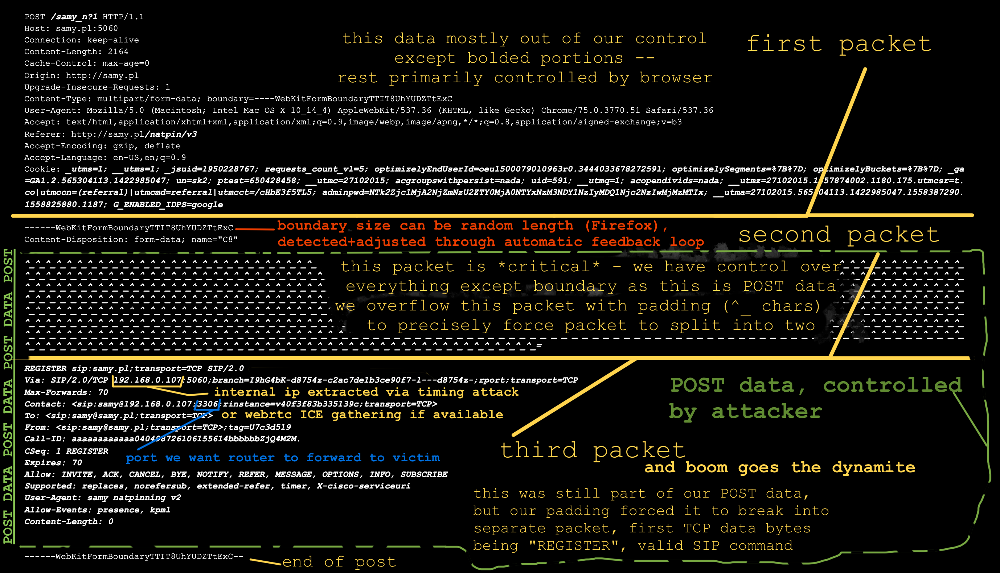](img/pinpkt2.png)


# The Deets

## Network Address Translation (NAT)

We use NATs (Network Address Translation) for several reasons. The most useful feature of NAT is that it allows a single public IP address to be shared among multiple systems. It does this by creating a local network, providing local IP addresses to all machines that connect, and when one of those systems reaches out to the Internet, it rewrites packets going out to use the public IP so responses come back to the NAT, and vice versa, rewriting destination IP to specific client's IP. 

It's the responsibility of the NAT to differentiate connections to the same addresses/ports (google.com:443) from internal hosts as ultimately their outbound port, destination ip and source ip will all be the same. If two different internal peers attempt to connect from the same source port, modern NATs will alter one of the source ports (some networks do this to all TCP/UDP source ports).

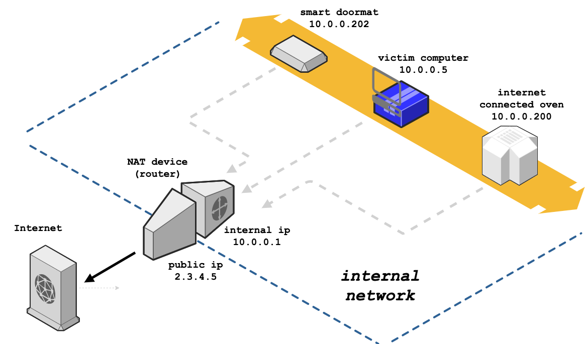

### Connection Tracking

From [Wikipedia ala Wikiwand](https://www.wikiwand.com/en/Netfilter):

```
One of the important features built on top of the Netfilter 
framework is connection tracking. Connection tracking 
allows the kernel to keep track of all logical network 
connections or sessions, and thereby relate all of the packets
which may make up that connection. NAT relies on this 
information to translate all related packets in the same way, 
and iptables can use this information to act as a stateful 
firewall.
```

If a machine behind your NAT sends a packet out and your router expects the remote host may respond, it keeps track of information, specifically the source and destination ports, source and destination IP addresses, and your internal IP, then returns any packets matching it back to your internal IP.

If another host on your LAN attempts to make the same connection with the same source and destination ports + IPs, your NAT wouldn't be able to discriminate it (the source IPs are different on your LAN but are rewritten to the same public IP on the WAN side), so it alters the source port, but rewrites it when sending back to you.

### Application Level Gateway

ALGs allow NAT to track a multi-port protocol like FTP to go out from your system to an FTP server, then track when you request a file to be sent to your internal IP on a specific port, the ALG can rewrite the packet to include your public IP, then forward the FTP's server connection back to you. Had it not rewritten your IP, the FTP server would try to connect back to you on your internal IP (or not try at all if it expects the source IP to be the same as the signaling connection).

From [Wikipedia](https://www.wikiwand.com/en/Application-level_gateway):

```
In the context of computer networking, an application-level 
gateway consists of a security component that augments a 
firewall or NAT employed in a computer network. It allows 
customized NAT traversal filters to be plugged into the 
gateway to support address and port translation for certain 
application layer "control/data" protocols such as FTP, 
BitTorrent, SIP, RTSP, file transfer in IM applications, etc. 
In order for these protocols to work through NAT or a 
firewall, either the application has to know about an address/
port number combination that allows incoming packets, or the 
NAT has to monitor the control traffic and open up port 
mappings (firewall pinhole) dynamically as required. 
Legitimate application data can thus be passed through the 
security checks of the firewall or NAT that would have 
otherwise restricted the traffic for not meeting its limited 
filter criteria.
```

## Router Investigation / Firmware Dumping

I'd first like to see how common gateways actually treat packets and multi-port protocols like FTP, SIP, etc. To do this, we'll want to reverse engineer the firmware from common routers. We could dump the flash from physical routers, however if we can get unencrypted firmware from the manufacturers, we'll be able to investigate more router models and much faster.

We'll start with a common router, the Netgear Nighthawk R7000. A [quick search](http://bfy.tw/NjZh) helps us find a [Netgear article](https://kb.netgear.com/000060566/R7000-Firmware-Version-1-0-9-64) with [recent firmware](http://www.downloads.netgear.com/files/GDC/R7000/R7000-V1.0.9.64_10.2.64.zip). Once we download the firmware and unzip, we find a 30MB file called R7000-V1.0.9.64_10.2.64.chk.

```sh
tigerblood:~c/ng$ wget http://www.downloads.netgear.com/files/GDC/R7000/R7000-V1.0.9.64_10.2.64.zip
--2019-05-19 19:21:13--  http://www.downloads.netgear.com/files/GDC/R7000/R7000-V1.0.9.64_10.2.64.zip
Resolving www.downloads.netgear.com (www.downloads.netgear.com)... 104.69.65.243
Connecting to www.downloads.netgear.com (www.downloads.netgear.com)|104.69.65.243|:80... connected.
HTTP request sent, awaiting response... 200 OK
Length: 31705064 (30M) [application/zip]
Saving to: ‘R7000-V1.0.9.64_10.2.64.zip’

R7000-V1.0.9.64_10.2.64.zip  100%[=============================================>]  30.24M  6.25MB/s    in 11s

2019-05-19 19:21:24 (2.83 MB/s) - ‘R7000-V1.0.9.64_10.2.64.zip’ saved [31705064/31705064]

tigerblood:~c/ng$ unzip R7000-V1.0.9.64_10.2.64.zip
Archive:  R7000-V1.0.9.64_10.2.64.zip
 extracting: R7000-V1.0.9.64_10.2.64.chk
  inflating: R7000-V1.0.9.64_10.2.64_Release_Notes.html
tigerblood:~c/ng$ file R7000-V1.0.9.64_10.2.64.chk
R7000-V1.0.9.64_10.2.64.chk: data
tigerblood:~c/ng$ ls -lh R7000-V1.0.9.64_10.2.64.chk
-rw-r--r--  1 samy  staff    30M Mar 26 11:46 R7000-V1.0.9.64_10.2.64.chk
```

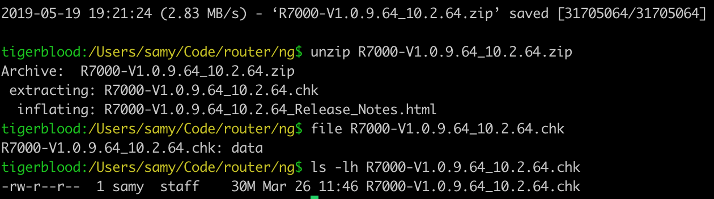

The `file` command doesn't detect any [magic info](https://www.wikiwand.com/en/Magic_number_(programming)), so we can use [`binwalk`](https://github.com/ReFirmLabs/binwalk) to scan the file for nested data.

```sh
tigerblood:~c/ng$ binwalk R7000-V1.0.9.64_10.2.64.chk

DECIMAL       HEXADECIMAL     DESCRIPTION
--------------------------------------------------------------------------------
58            0x3A            TRX firmware header, little endian, image size: 31703040 bytes, CRC32: 0xBEF1BB2F, flags: 0x0, version: 1, header size: 28 bytes, loader offset: 0x1C, linux kernel offset: 0x21E3F0, rootfs offset: 0x0
86            0x56            LZMA compressed data, properties: 0x5D, dictionary size: 65536 bytes, uncompressed size: 5436416 bytes
2221098       0x21E42A        Squashfs filesystem, little endian, version 4.0, compression:xz, size: 29475437 bytes, 1988 inodes, blocksize: 131072 bytes, created: 2018-12-26 04:15:38
```
	
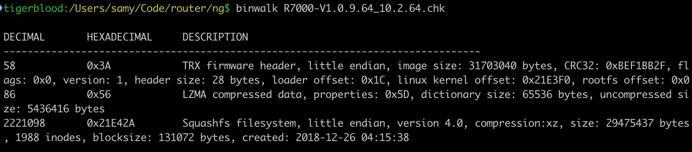

I use macOS and binwalk depends on some Linux apps out of the box which would cause `binwalk -e` (which extracts files) to fail so I extract manually (and I <3 perl golf).

```sh
tigerblood:~c/ng$ perl -ne'$@.=$_}{print+substr$@,2221098' R7000-V1.0.9.64_10.2.64.chk > squash.fs
```

Or use [`inout`](https://github.com/samyk/samytools/blob/master/inout), eg `inout R7000-V1.0.9.64_10.2.64.chk 2221098`.

You could use `dd`, however you'd want a large `bs` (block size) so that it would output quickly, eg 1024, however the `skip` attribute (to tell it to start at the location of the squashfs blob) would respect the block size and 2221098 isn't obviously divisible in anything quickly in my head other than 2...now I'm curious.

```sh
tigerblood:~c/ng$ time dd if=R7000-V1.0.9.64_10.2.64.chk skip=$((2221098/2)) bs=2 of=squash.fs2
14741000+0 records in
14741000+0 records out
29482000 bytes transferred in 78.363403 secs (376222 bytes/sec)

real	1m18.385s
user	0m12.553s
sys  	1m4.451s
```

Now let's unpack the squash filesystem. I've created a [fork of a fork of squashfs-tools](https://github.com/samyk/squashfs-tools) that runs on macOS and has `lzo` support. You may need to install `xz` and `lzo` as well. Alternatively, you could use [`sasquatch`](https://github.com/devttys0/sasquatch) on Linux.

```sh
tigerblood:~c/ng$ sudo port install xz lzo
...
tigerblood:~c/ng$ git clone https://github.com/samyk/squashfs-tools && cd squashfs-tools/squashfs-tools && make && sudo make install && cd ../..
```

And finally we can unpack the squash fs.

```sh
tigerblood:~c/ng$ unsquashfs -l -no squash.fs
Parallel unsquashfs: Using 8 processors
1881 inodes (2535 blocks) to write

squashfs-root
squashfs-root/bin
squashfs-root/bin/addgroup
... (many more files) ...

tigerblood:~c/ng$ cd squashfs-root && ls
bin   data  dev   etc   lib   media mnt   opt   proc  sbin  share sys   tmp   usr   var   www
```

We now have the raw OS to explore!

## Reverse Engineering Firmware

### Finding Interesting Files

Now let's see if we can find any files relevant to FTP as it was a heavily used protocol so ALG support will be rampant across routers. I use my [`g tool`](https://github.com/samyk/samytools/blob/master/g) which is just a convenient wrapper around `egrep`.

```sh
tigerblood:~c/ng/squashfs-root$ find . | g ftp
./usr/bin/tftp
./usr/sbin/bftpd
./usr/sbin/ftp
./usr/sbin/ftpc
./usr/etc/sftp-ssh.service
```

Nothing interesting, so let's `g` for binary files whose content matches /ftp/, ignoring some files we don't care about.

```sh
tigerblood:~c/ng/squashfs-root$ g -la ftp -v '\.(html?|js|gif)$|www/|bin/'
lib/libsmbd-base-samba4.so
lib/libavformat.so.55
lib/libavutil.so.52
lib/libavcodec.so.55
lib/modules/tdts.ko
lib/modules/2.6.36.4brcmarm+/kernel/lib/br_dns_hijack.ko
lib/libcrypto.so.1.0.0
opt/xagent/certs/ca-bundle-mega.crt
usr/etc/sftp-ssh.service
usr/lib/libnvram.so
usr/lib/libcurl.a
usr/lib/libcurl.so.4.3.0
usr/lib/libcurl.so
usr/share/avahi/service-types
usr/share/libcrypto.so.1.0.0
```

 [`g`](https://github.com/samyk/samytools/blob/master/g) recursively scans the current working directory by default. `-l` is to only print file names (as these will be mostly binary), `-a` to scan binary files, `ftp` for text to match, and `-v '\.(html?|js|gif)$|www/|bin/'` to ignore web files and executables (sitting in (s)bin/).

Any `lib/lib*.{a,so}{.*,}` (bash format) files are uninteresting, so let's scan again with less:

```sh
tigerblood:~c/ng/squashfs-root$ g -la ftp -v '\.(html?|js|gif)$|www/|bin/|lib.*\.(so|a)(\.|$)'
lib/modules/tdts.ko
lib/modules/2.6.36.4brcmarm+/kernel/lib/br_dns_hijack.ko
opt/xagent/certs/ca-bundle-mega.crt
usr/etc/sftp-ssh.service
usr/share/avahi/service-types
```

### Exploring Potentially Useful Functions

Okay, two files of interest -- `lib/modules/tdts.ko` could be related, and `lib/modules/2.6.36.4brcmarm+/kernel/lib/br_dns_hijack.ko` is probably not related but sounds interesting! May investigate that later.

```sh
tigerblood:~c/ng/squashfs-root$ file lib/modules/tdts.ko
lib/modules/tdts.ko: ELF 32-bit LSB relocatable, ARM, EABI5 version 1 (SYSV), BuildID[sha1]=0aa35748e245e60273ceb5a48641e424d069235b, not stripped
tigerblood:~c/ng/squashfs-root$ strings lib/modules/tdts.ko | g ftp
ftp_decoder_open
ftp_decoder_close
ftp_decode_epsv_resp
ftp_decode_eprt_cmd
ftp_decode_pasv_resp
ftp_decode
ftp_decode_port_cmd
ftp_decoder
check_ftp_ft_rule
```

Nice! A kernel object (.ko) with ftp functions, and with words like "port", it's likely related to an FTP ALG. The [FTP RFC 959](https://tools.ietf.org/html/rfc959) explains the meaning of the `PORT` command:

```
DATA PORT (PORT)

The argument is a HOST-PORT specification for the data port
to be used in data connection.  There are defaults for both
the user and server data ports, and under normal
circumstances this command and its reply are not needed.  If
this command is used, the argument is the concatenation of a
32-bit internet host address and a 16-bit TCP port address.
This address information is broken into 8-bit fields and the
value of each field is transmitted as a decimal number (in
character string representation).  The fields are separated
by commas.  A port command would be:
    PORT h1,h2,h3,h4,p1,p2
where h1 is the high order 8 bits of the internet host
address.
```

### Ports / Services to Investigate

While we've found some FTP functions, we're more interested in ports that we can use. Modern browsers prevent outbound HTTP(S) connections to a number of [restricted ports](https://github.com/samyk/chromium/blob/2d57e5b8afc6d01b344a8d95d3470d46b35845c5/net/base/port_util.cc#L20-L90), including FTP, so abusing the FTP ALG is likely a no-go.

In 2010, when I [first demonstrated NAT Pinning](https://samy.pl/natpin/), I used port 6667 (IRC) via the DCC CHAT/FILE messages. Quickly, browser vendors blocked port 6667...though some used a uint32 (32 bit unsigned integer) to store the port, check if the port was blocked, and if not, connect. To evade this, it's important to note TCP ports are 16 bits long, so if you add 2**16 (65536) to the "restricted" port of choice, in this case 65536+6667=72203, the browser would store 72203, it would pass the port restriction (72203 != 6667), then would get sent off to the TCP stack where it gets truncated to 16 bits which is the restricted port we wanted!

My simple [`base calculator, 3`](https://github.com/samyk/samytools/blob/master/3) shows this (db = dec -> bin):

```sh
tigerblood:/Users/samy/d$ 3 db 65536 6667 65536+6667
000000010000000000000000
000000000001101000001011
000000010001101000001011
```

We can see it better using my [`diffbits`](https://github.com/samyk/samytools/blob/master/diffbits) tool, a simple tool for viewing similarities and differences between bit strings, as well as between multiple groups of bit strings, useful for reversing proprietary, binary protocols.

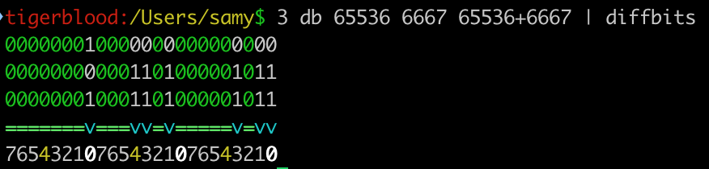


### Reversing the Kernel Object

Go ahead and open your disassembler of choice. I've used [Ghidra](https://ghidra-sre.org) from our friends at the [NSA](https://github.com/NationalSecurityAgency/) as it's free and open source.

Some of the functions we saw in `tdts.ko` via `strings` was `ftp_decode` and `ftp_decoder`, so it's possible other ALGs will have a `_decode` function. Let's look...

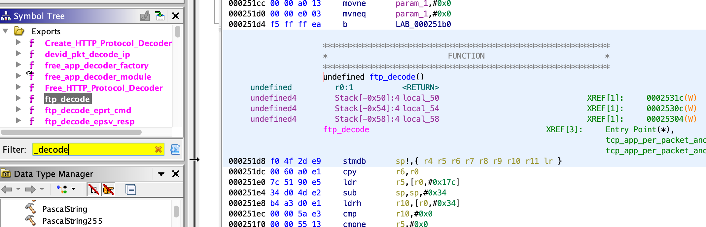

Alright, a bunch of _decode functions...scrolling down, an interesting one is `sip_decode`.

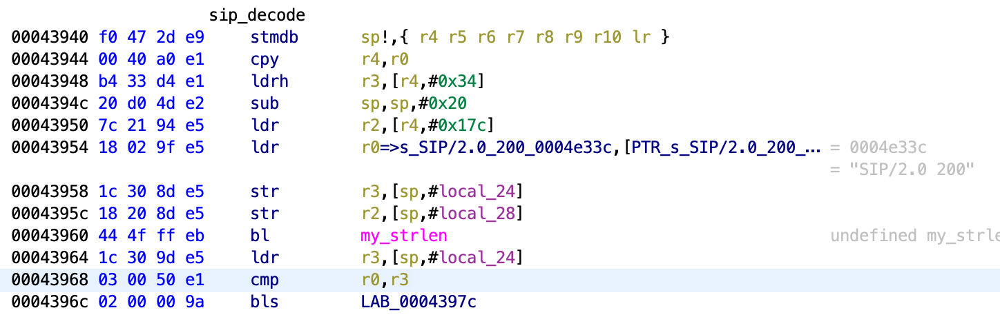

Checking our [restricted browser ports](https://github.com/samyk/chromium/blob/2d57e5b8afc6d01b344a8d95d3470d46b35845c5/net/base/port_util.cc#L20-L90), we see 5060, the default SIP port, is not restricted in Chrome :)

### Attempting SIP Packet in HTTP POST

SIP lives on TCP/UDP 5060, but media like RTP (audio) is sent on alternate ports that are generated on the fly. When sending a request for a SIP call, your SIP client chooses a random port, opens it, and includes it in the SIP header. Your NAT should also see it and open it up, assuming the SIP ALG is enabled (and is on most routers by default).

Assuming NATs read SIP packets line by line (SIP is newline-based like HTTP and is not a binary protocol), perhaps it will ignore the HTTP header and once it gets to the POST data, read the REGISTER and believe it's a SIP packet. This worked in our 2010 version for the IRC DCC. The NAT ignored the HTTP header and just parsed the IRC DCC command.

Funny thing, this also allowed us to actually make users who visit our site connect to a *legitimate* IRC server, join a channel, and send a message from their IP without them knowing! :P I demo'd this technique for sending email to mail servers with client IP addresses before port 25 was blocked by browsers and before SPF records were common...craziness.

Now, in a quick test, sending a SIP REGISTER packet over port 5060 through an HTTP POST doesn't seem to work...perhaps we're missing something from the packet.

```javascript
// our sip message
var sipmsg = 'REGISTER sip:samy.pl;transport=TCP SIP/2.0\r\n' +
             'Contact: <sip:samy@192.168.0.109:1234;transport=TCP>\r\n\r\n'

// load form in an iframe so user doesn't see it
var iframe = document.createElement('iframe')
iframe.name = 'iframe'
iframe.style.display = 'none' // hide the iframe

// create form
var form = document.createElement('form')
form.setAttribute('target', 'iframe') // load into iframe
form.setAttribute('method', 'POST') // need the POST area where we can add CRLFs
form.setAttribute('action', 'http://samy.pl:5060') // "http" server on SIP port 5060
form.setAttribute('enctype', 'multipart/form-data') // ensure our data doesn't get encoded

var textarea = document.createElement('textarea')
textarea.setAttribute('name', 'textname') // required
textarea.innerHTML = sipmsg
form.appendChild(textarea)
document.body.appendChild(iframe)
document.body.appendChild(form)
form.submit()
```

If we sniff, we see (parsed via [`h2b`](https://github.com/samyk/samytools/blob/master/h2b)):

```sh
$ unbuffer tcpdump -X port 5060 | h2b
POST / HTTP/1.1
Host: samy.pl:5060
Connection: keep-alive
Content-Length: 191
Cache-Control: max-age=0
Origin: http://samy.pl
Upgrade-Insecure-Requests: 1
Content-Type: multipart/form-data; boundary=----WebKitFormBoundaryhcoAd2iSAx3TJA7A
User-Agent: Mozilla/5.0 (Macintosh; Intel Mac OS X 10_14_4) AppleWebKit/537.36 (KHTML, like Gecko) Chrome/75.0.3770.66 Safari/537.36
Accept: text/html,application/xhtml+xml,application/xml;q=0.9,image/webp,image/apng,*/*;q=0.8,application/signed-exchange;v=b3
Referer: http://samy.pl/o/sp.html
Accept-Encoding: gzip, deflate
Accept-Language: en-US,en;q=0.9

------WebKitFormBoundaryhcoAd2iSAx3TJA7A
Content-Disposition: form-data; name="textname"

REGISTER sip:samy.pl;transport=TCP SIP/2.0
Contact: <sip:samy@192.168.0.109:1234;transport=TCP>


------WebKitFormBoundaryhcoAd2iSAx3TJA7A--
```

However, this doesn't open the port, nor is the IP rewritten which we'd expect (more on this later), so we must be missing something.

### Continue Reversing Kernel Object Further

Let's keep digging in the kernel object. In the diassembly, we see the "SIP/2.0" tag from a SIP packet, so it's likely parsing here (which "decode" sounds like).

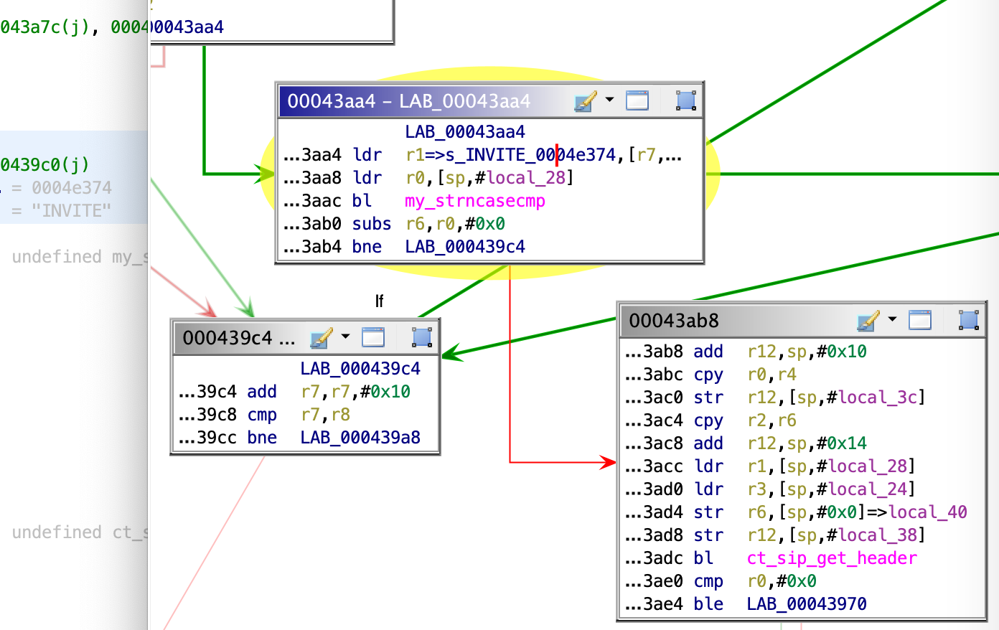

Ah, this is why we fail. Looks like it's running strncasecmp on [INVITE](https://tools.ietf.org/html/rfc2543#section-4.2.1) (similar parsing on REGISTER) -- matching (case-insensitive, which is interesting as SIP INVITEs are upper case) the word "INVITE" at the beginning of the packet and **b**ranches if **n**ot **e**qual (ARM assembly `bne`) to 0, so if the words do match, the lexicographical order will be 0 and we'll continue to `ct_sip_get_header` which sounds fun, and seems to bail otherwise.

This is the problem...while we can use a web browser to produce outbound sockets (TCP via HTTP(S), UDP via TURN w/WebRTC), we don't have enough control over the browser to start the TCP data portion with the word "INVITE", which this module expects. In the [2010 IRC version](https://samy.pl/natpin/), the IRC ALG only looked line by line, ignoring all the HTTP header data, then using newlines in the POST data to send a valid "IRC DCC". However, this SIP ALG is much more strict and controlling the beginning of the request is not possible. If using TLS, encrypted header will start the packet. If using HTTP, the HTTP method will begin the packet (GET, POST, etc). Can we exploit this some other way?

## Connection Tracking / Application Level Gateway Investigation

### Linux Netfilter

To better understand connection tracking and Application Level Gateways, we can look to see how they behave in [netfilter, Linux's network stack](https://github.com/samyk/linux/tree/master/net/netfilter). I've created a chart of the most common ALGs and how they behave based off of parsing the Linux source.

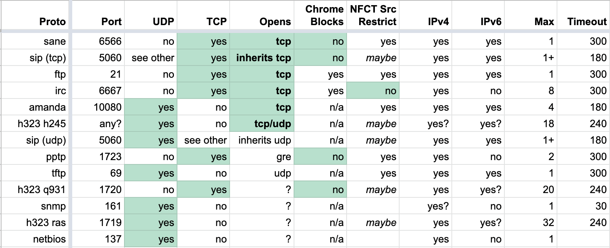

From this chart, the most interesting ones (that Chrome does not block) are sane (backup), sip (voip), pptp (vpn), and h323 (voip). We'll choose SIP as it's one of the more ubiquitous of these protocols, and we already see it in some routers' firmware.

Linux specifically has `nf_conntrack_*.c` files for handling connection tracking on a per protocol basis, and `nf_nat_*.c` for packet mangling (modification).

We'll take a quick look at the [SIP connection tracking module](https://github.com/samyk/linux/blob/29b0b5d56589d66bd5793f1e09211ce7d7d3cd36/net/netfilter/nf_conntrack_sip.c)

- [`module_init(nf_conntrack_sip_init)`](https://github.com/samyk/linux/blob/29b0b5d56589d66bd5793f1e09211ce7d7d3cd36/net/netfilter/nf_conntrack_sip.c#L1698) initialize this connection tracker, calling [`nf_conntrack_sip_init`](https://github.com/samyk/linux/blob/29b0b5d56589d66bd5793f1e09211ce7d7d3cd36/net/netfilter/nf_conntrack_sip.c#L1662)
- [`nf_ct_helper_init(...AF_INET, IPPROTO_TCP, "sip", SIP_PORT...)`](https://github.com/samyk/linux/blob/29b0b5d56589d66bd5793f1e09211ce7d7d3cd36/net/netfilter/nf_conntrack_sip.c#L1676) we expect signaling to come in from IPv4 `AF_INET` TCP `IPPROTO_TCP` port 5060 `SIP_PORT`...this occurs for UDP, TCP, IPv4 & IPv6
- [`sip_help_tcp(...)`](https://github.com/samyk/linux/blob/29b0b5d56589d66bd5793f1e09211ce7d7d3cd36/net/netfilter/nf_conntrack_sip.c#L1524) called when matching TCP SIP packet comes in
  - [`process_sip_msg(...)`](https://github.com/samyk/linux/blob/29b0b5d56589d66bd5793f1e09211ce7d7d3cd36/net/netfilter/nf_conntrack_sip.c#L1500) if this looks like a potential SIP packet
     - [`process_sip_request(...)`](https://github.com/samyk/linux/blob/29b0b5d56589d66bd5793f1e09211ce7d7d3cd36/net/netfilter/nf_conntrack_sip.c#L1444) is this is a request
     - [`strncasecmp(*dptr, handler->method, ...)`](https://github.com/samyk/linux/blob/29b0b5d56589d66bd5793f1e09211ce7d7d3cd36/net/netfilter/nf_conntrack_sip.c#L1476-L1478) **the handler will bail unless the method (eg, REGISTER) occurs at the *start* of the data portion of the packet (TCP or UDP)** like we saw with INVITE up above...[REGISTER](https://tools.ietf.org/html/rfc2543#section-4.2.6) is just another SIP command
     - this is a challenge as if we're only using a web browser, we can't produce a raw TCP connection and start any packet with our own data, as it will be filled with HTTP/TLS headers...or can we?
     - [`process_register_request(...)`](https://github.com/samyk/linux/blob/29b0b5d56589d66bd5793f1e09211ce7d7d3cd36/net/netfilter/nf_conntrack_sip.c#L1216)[`nf_ct_expect_init(...)`](https://github.com/samyk/linux/blob/29b0b5d56589d66bd5793f1e09211ce7d7d3cd36/net/netfilter/nf_conntrack_sip.c#L1289) via [`sip_handlers`](https://github.com/samyk/linux/blob/29b0b5d56589d66bd5793f1e09211ce7d7d3cd36/net/netfilter/nf_conntrack_sip.c#L1391) we initialize the firewall pinhole (port to allow remote person to connect back in), but we don't open it just yet
     - [`nf_nat_sip_hooks`](https://github.com/samyk/linux/blob/29b0b5d56589d66bd5793f1e09211ce7d7d3cd36/net/netfilter/nf_conntrack_sip.c#L1295) -> [`nf_nat_sip(...)`](https://github.com/samyk/linux/blob/29b0b5d56589d66bd5793f1e09211ce7d7d3cd36/net/netfilter/nf_nat_sip.c#L144) the NAT also mangles (rewrites) the internal IP address of the client to the NAT's public IP so the destination can properly reach it
- [`sip_help_tcp(...)`](https://github.com/samyk/linux/blob/29b0b5d56589d66bd5793f1e09211ce7d7d3cd36/net/netfilter/nf_conntrack_sip.c#L1524) -> [`process_sip_msg(...)`](https://github.com/samyk/linux/blob/29b0b5d56589d66bd5793f1e09211ce7d7d3cd36/net/netfilter/nf_conntrack_sip.c#L1500) ->
  - [`process_sip_response(...)`](https://github.com/samyk/linux/blob/29b0b5d56589d66bd5793f1e09211ce7d7d3cd36/net/netfilter/nf_conntrack_sip.c#L1400) now we're looking at SIP response from the SIP server
      - [`process_register_response(...)`](https://github.com/samyk/linux/blob/29b0b5d56589d66bd5793f1e09211ce7d7d3cd36/net/netfilter/nf_conntrack_sip.c#L1314) -> [`refresh_signalling_expectation(...)`](https://github.com/samyk/linux/blob/29b0b5d56589d66bd5793f1e09211ce7d7d3cd36/net/netfilter/nf_conntrack_sip.c#L1381) the port is forwarded by the NAT only once a valid SIP response is sent by the SIP server


## Packet Boundary Control

As far as we know, we can't make the browser force an outbound TCP connection with whatever traffic we want, and it's necessary for us to create a TCP/UDP packet starting with a SIP method such as REGISTER or INVITE.

Flash used to allow outbound sockets, but was in a format that we didn't have full control of. Java requires permission. WebSockets are still HTTP. TLS is encrypted. [WebRTC (RFC 7742)](https://tools.ietf.org/html/rfc7742) is encrypted. [STUN (RFC 3489)](https://tools.ietf.org/html/rfc3489) and [TURN (RFC 5766)](https://tools.ietf.org/html/rfc5766) are in fixed formats, and [TURNS (RFC 7065)](https://tools.ietf.org/html/rfc7065) is encrypted.

## TCP Segmentation

At a high level, we can't control the start of the TCP packet, but what if we send too large of a packet? There must be a maximum packet size...at which point, a packet must be fragmented into multiple packets. **If we can overflow the TCP packet size and precisely control part of the data, could we cause packet segmentation and have our data be at the very beginning of our next, overflowed packet?**

Well, we would need to know how much data the browser will send, which will be different per browser, and even by user as they may send different HTTP headers. HTTPS won't work as most of the content is encrypted, where an HTTP POST allows us to control a large portion of the header.

To get the general size of the packet, we send a **large** (6000 byte) HTTP POST with an ID and padding data with a hidden web form to our http://our.attack.server:5060/pktsize. On the attack server, we run a [packet sniffer](https://github.com/samyk/slipstream/blob/main/max_pkt_size.pl) which looks for the boundaries of our packet to determine MTU (Maximum Transmission Unit) size, IP header size, potential IP options, TCP header size, potential TCP options, data packet size, and what portion of the packet we control.

We also run a [custom server](https://github.com/samyk/slipstream/blob/main/serv-sip.pl) that listens on TCP port 5060, and responds with HTTP traffic to appease the browser so nothing looks fishy on the client side (a server with a malformed response would cause errors in the console, or an incorrectly responding server would keep the status spinner going).

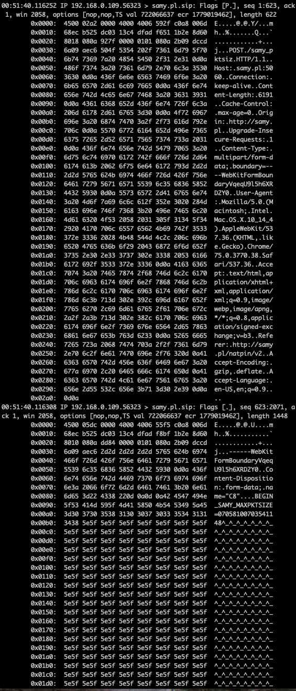

We further attempt to control the TCP packet data size by sending a Maximum Segment Size (mss) TCP Option during the initial SYN response to manipulate the victim's outbound packet sizes ([RFC 793 x3.1](https://tools.ietf.org/html/rfc793#section-3.1)). This tells the victim machine to keep TCP packets to a certain size.

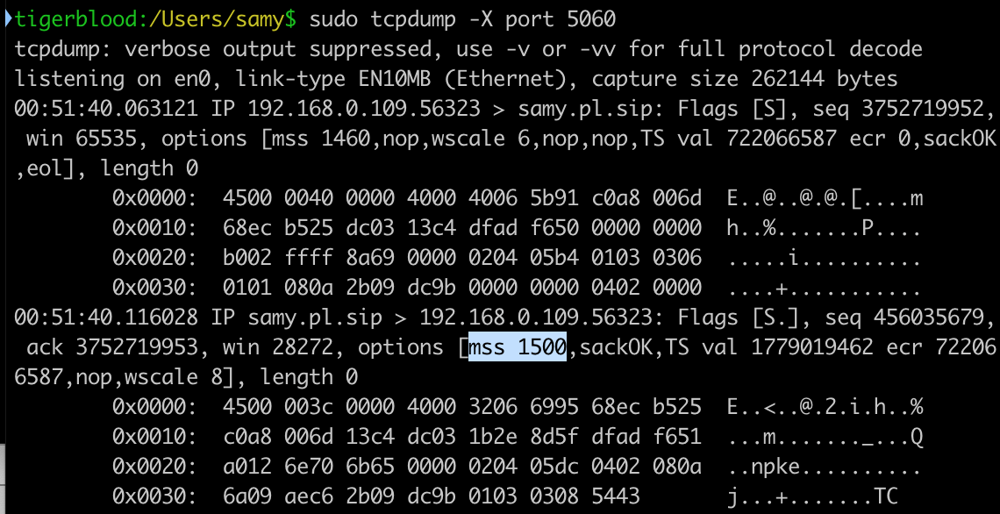

You can do this on Linux by appending `advmss <size>` to `ip route`. We'll use 1500.

```sh
ip route replace default via [gateway] dev eth0 advmss 1500
```

Once we get the packets, we send the size data back to the victim client over a separate POST, which sent the victim's ID so we can correlate it with the original request from the victim. At this point, the client has a good idea of how to pad packets to cause arbitrary data to land at any specific location in a TCP packet.

### IP Fragmentation with UDP and TURN

Some NATs only allow UDP ports to be accessed if the SIP connection was originally UDP, so we use TURN in this case. TURN is a protocol supporting relaying for peer-to-peer communication like SIP and WebRTC. TURN is UDP while TURNS (TURN+TLS) is TCP. Modern browsers support TURN for WebRTC in case they can't make a direct peer-to-peer connection with each other for media sharing.

TURN allows authentication via username and password, the username is sent in cleartext. Interestingly, the username is not limited by any size or characters, so we can use this to perform the same type of packet overflow.

Since TURN is over UDP, the IP packet itself will get fragmented if overflowing over the MTU size (UDP doesn't support segmentation). The 2nd packet will have not only the data portion under our control, but the UDP header as well! This is not important for our attack, but is interesting and can definitely produce alternate attacks. Ultimately we can perform the same attack through UDP by aligning our packet boundary based off of calculated MTU size rather than MSS size, making our SIP UDP packet live on the 2nd packet boundary (with a fake UDP header prepended) allowing us to forward UDP ports back to our vitim.

## TCP Timing Attack / Internal Subnet & IP Discovery

Oh, this still won't work! In order for the ALG to treat it as a legitimate SIP packet, the IP address you're requesting data to come back on (in the [`Contact`](https://tools.ietf.org/html/rfc2543#section-6.13) SIP line) must be the internal IP (victim) the SIP packet came from, which we don't know. Only the router's public IP address is transmitted to our server (as the NAT rewrites the source IP when it exits the public side).

We see this check in Linux's `nf_conntrack_sip.c`'s [process\_sip\_request](https://github.com/samyk/linux/blob/ea2cec24c8d429ee6f99040e4eb6c7ad627fe777/net/netfilter/nf_conntrack_sip.c#L1260):

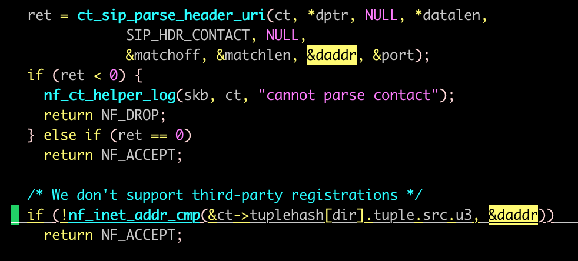

In [2010](https://samy.pl/natpin/), we used [LiveConnect](https://developer.mozilla.org/en-US/docs/Archive/Web/LiveConnect) which allowed executing Java code under some conditions from Javascript, extracting the user's local IP. That became obsolete pretty quickly.

On some browsers (Chrome, Firefox), we can use [WebRTC](https://www.w3.org/TR/webrtc/) to grab the victim's internal IP address via [ICE](https://tools.ietf.org/html/rfc5245) (which just use STUN/TURN/TURNS). These are protocols for helping peers behind NATs determine information about themselves. Ironically, no server needs to be used in the ICE "request" as the browser already knows its internal IP, and a remote STUN/TURN server wouldn't know it anyway unless the client sent it in the first place. The problem is not all browsers provide this mechanism.

As of today, using WebRTC to get the local IP address on Chrome, rather than a `.local` mDNS/Bonjour address, requires using HTTPS, but HTTP is necessary for the rest of the attacks, so we first detect if we're on HTTP and if not, rdirect to HTTPS. We then attempt to use WebRTC to extract the local IP address. Either way, we then redirect back to HTTP with the IP(s) appended to the URL to bypass cross-origin restrictions via other communication methods.

### Timing Attack

If using Safari, IE <= 11, or others that don't support WebRTC or intentionally don't reveal internal IP (Safari), we can use a web timing attack to reveal the victim's internal IP address.

We manage this by first producing hidden HTML `` tags on the page, all to common gateways (192.168.*.1, 10.0.0.1, and [others](https://github.com/samyk/slipstream/blob/main/server#L159)), along with Javascript `onsuccess` and `onerror` events. Each time an img is written to the page, a timer is started and if the `onsuccess` loads, that means the IP responded with a web server, and if no web server is running but the IP is on the network, it will send a TCP RST (reset, meaning port not open) back, triggering the `onerror`. If no IP exists, no RST is sent and the response will take > 1 second, at which point we know the IP doesn't exist on our network.

Once we see one of these events trigger, we know a potential internal subnet we're on, then we perform the same attack for every IP on the subnet (eg, 192.168.0.[2-255]), and this time perform a more precise timing to determine which IP responds **fastest**. This is most likely our own (victim) internal IP, as we don't even need to leave the network interface. Even if we aren't first for some reason, we still attempt our attack on all IPs that responded on the network.

## Browser Protocol Confusion

Once the client gets the packet sizes and internal IP address, it constructs a specially crafted web form that pads the POST data up until we believe the packet will become fragmented, at which point our SIP REGISTER containing internal IP address is appended. The form is submitted via Javascript with no consent from the victim. :)

[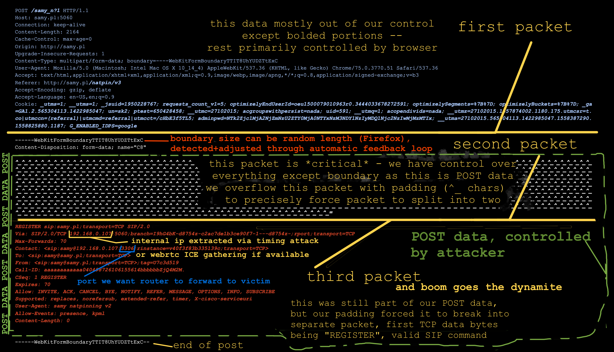](img/pinpkt.png)

### Live Browser Packet Alteration

On our attack server, because we can see the packets come in, we look to see if the SIP packet was rewritten with the public IP address. If it wasn't, we communicate back the client (automatically) that the SIP packet was not on the expected packet boundary and not rewritten, and we provide the new boundary position from our sniffer.

The client code automatically adjusts its packet size to the new size only after two failures in a row. Some browsers (Firefox) will sometimes have a slightly different packet size due to the multipart-boundary they generate for the form, which unlike most other browsers, is not a fixed length. I find after about 10 tries, the same size will be used and the attack will succeed.

Once the SIP packet lands on the packet boundary, the NAT will be deceived, believing this is a legitimate SIP registration and from a SIP client on the victim's machine. Once our server responds with a proper SIP response (nested inside of a proper HTTP response to allow the browser to not detect anything fishy), the NAT will open up the port in the original packet we had the victim send and the router will now **forward any port the attacker chooses back to the internal victim, all from simply browsing to a website**.

Attack complete. Attacker can now connect to arbitrary TCP/UDP services running on victim.

# Other Findings

These are not used in this attack, but are interesting nonetheless and could potentially be used for other attacks.

- IP fragmentation allows full control of all data in the IP data section, meaning full control of a UDP header including source/dest ports in the overflowed packet
  - victim IP stack reassembles and won't parse the data, however the NAT that the packet flows through will be susceptible
  - allows bypassing browser or system firewall as only UDP port that's inspected is the original packet, not the overflowed fragmented packet
- DoS a SIP client by sending `Expires: 0` and removing conntrack for someone else
- If a port is already taken, port listened to is incremented until port overflows to 0
- STUN does not have authentication implemented in any modern browser


# Download

Thanks for reading! You can download the proof of concept code from my [NAT Slipstream github](https://github.com/samyk/slipstream).

# Contact

**Point of Contact:** [@SamyKamkar](https://twitter.com/samykamkar)

Find more of my projects at <https://samy.pl> or potentially reach me at <code@samy.pl>.
